# UniHandicap — Accessible University Services Desktop App


> **Portfolio project:** a JavaFX desktop application that helps universities manage disability accommodation requests, accessibility complaints, notifications, audit history, and PDF exports through an accessible, role-based interface.

---

## 🎯 Portfolio Summary

**UniHandicap** is a desktop application designed for university accessibility services. It replaces fragmented workflows such as emails, paper forms, and spreadsheets with a centralized system where students submit accommodation requests and administrators manage them efficiently.

This project demonstrates practical skills in **Java**, **JavaFX**, **MVC architecture**, **JDBC database access**, **role-based workflows**, **accessibility-oriented UI design**, and **technical documentation**.

---

## 🧩 Problem Solved

Universities need to manage accommodation requests for students with disabilities in a reliable and accessible way. Manual processes can cause lost requests, slow treatment, poor traceability, and accessibility barriers.

UniHandicap provides:

- A dedicated student space for submitting and tracking requests
- An administrator dashboard for reviewing and processing requests
- Complaint management and status updates
- Notifications and audit history
- Accessibility support through adaptive themes, audio feedback, and voice-oriented features
- PDF export for official request summaries

---

## ✨ Key Features

### 👨‍🎓 Student Workspace

- Accessibility color-vision test before login
- Secure authentication
- Submit accommodation requests
- Attach supporting documents
- Track request status: pending, accepted, refused
- Submit and follow accessibility complaints
- Receive visual and audio notifications
- Export accommodation requests as PDF files

### 🛠️ Administrator Workspace

- View all student requests
- Accept or refuse accommodation requests
- Manage student complaints
- Search and filter archived records
- Access dashboard statistics
- View audit history
- Generate activity/reporting outputs

### ♿ Accessibility Features

- High-contrast theme
- Color-blind friendly theme
- Audio alerts for success, errors, and notifications
- Voice-assisted input support
- Text-to-speech style feedback utilities
- Interface designed around accessibility-first workflows

---

## 🧱 Tech Stack

| Layer | Technology |
|---|---|
| Language | Java |
| UI | JavaFX, FXML, CSS |
| Architecture | MVC |
| Database | MySQL 8 |
| Database Access | JDBC, PreparedStatement |
| Build Tool | Maven |
| Audio | Java Sound API, JavaFX Media |
| Speech Recognition | Vosk / optional online speech recognition integration |
| PDF Export | iText 7 |

---

## 🏗️ Architecture

The application follows an MVC-style organization:

```text
src/main/java/com/universite/
├── config/        # Database and app configuration
├── controller/    # JavaFX controllers and UI logic
├── dao/           # Data access objects using JDBC
├── model/         # Business entities
├── util/          # Audio, PDF, speech, and helper utilities
└── MainApp.java   # Application entry point
```

Main resources:

```text
src/main/resources/
├── css/           # Standard, high-contrast, and color-blind themes
├── fxml/          # JavaFX screens for auth, student, and admin spaces
└── sounds/        # Accessibility audio feedback
```

---

## 📁 Project Structure

```text
UniHandicap/
├── database/
│   └── schema.sql
├── docs/
│   ├── Report.pdf
│   ├── Rapport_Projet_DisabiliteApp.pdf
│   └── PORTFOLIO_PRESENTATION.md
├── screenshots/
│   └── (documentation and UI screenshots)
├── videos/
│   └── (demo and test videos)
├── src/
│   ├── main/java/com/universite/
│   └── main/resources/
├── pom.xml
├── README.md
├── LICENSE
└── .gitignore
```

---

## ⚙️ Requirements

- Java JDK 17 recommended
- Maven 3.8+
- MySQL 8+
- Optional: Vosk model for offline speech recognition
- Optional: API key for online speech recognition integration

---

## 🚀 Getting Started

### 1. Clone the repository

```bash
git clone https://github.com/YOUR_USERNAME/UniHandicap.git
cd UniHandicap
```

### 2. Create the database

```bash
mysql -u root -p < database/schema.sql
```

### 3. Configure database credentials

Using environment variables:

```bash
set DB_PASSWORD=YOUR_PASSWORD
mvn javafx:run
```

On macOS/Linux:

```bash
export DB_PASSWORD=YOUR_PASSWORD
mvn javafx:run
```

You can also pass database settings as JVM properties:

```bash
mvn javafx:run   -Ddb.host=localhost   -Ddb.port=3306   -Ddb.name=universite_accessibilite   -Ddb.user=root   -Ddb.password=YOUR_PASSWORD
```

---

## ▶️ Run the Application

```bash
mvn javafx:run
```

On Windows:

```bash
run-javafx.cmd
```

---

## 🖼️ Screenshots

### 📐 Architecture & Design Documentation

<div align="center">
<table>
<tr>
<td width="33%">
<a href="screenshots/01-class-diagram.png">
  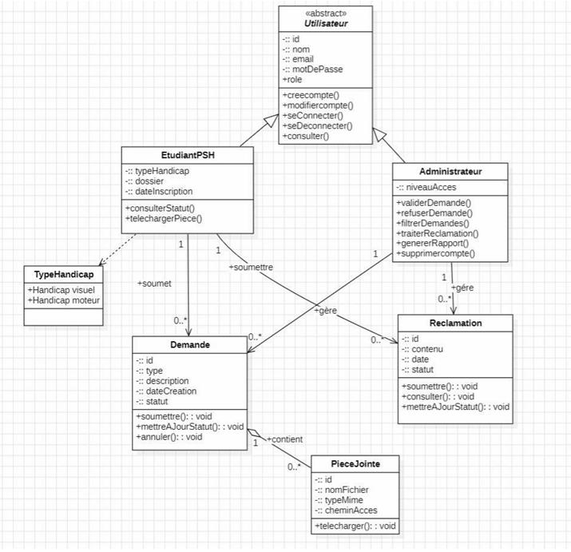
</a>
<sub><b>Class Diagram</b><br/>System Architecture</sub>
</td>
<td width="33%">
<a href="screenshots/02-use-case-requests.png">
  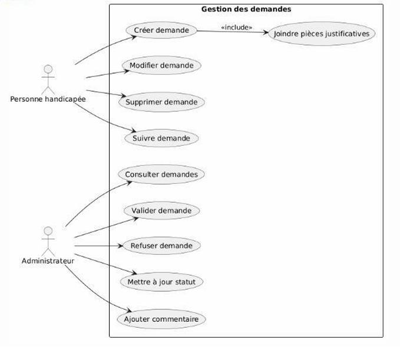
</a>
<sub><b>Use Case Diagram</b><br/>Request Management</sub>
</td>
<td width="33%">
<a href="screenshots/03-global-use-case-modules.png">
  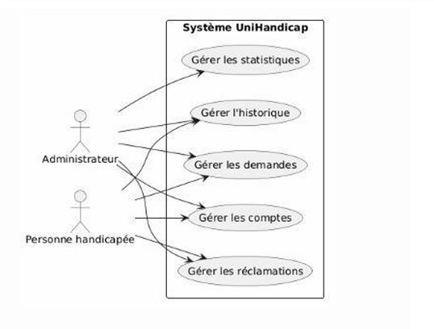
</a>
<sub><b>Global Use Cases</b><br/>All Modules</sub>
</td>
</tr>
</table>
</div>

### 🔄 Sequence Diagrams

<div align="center">
<table>
<tr>
<td width="33%">
<a href="screenshots/04-sequence-login.png">
  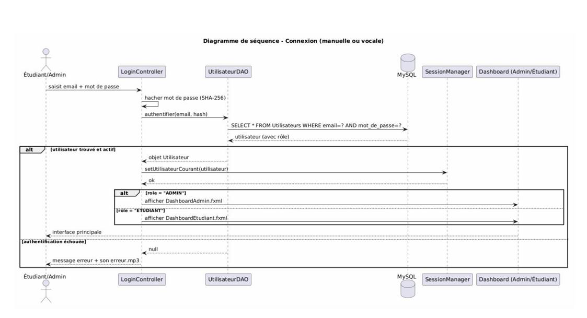
</a>
<sub><b>Login Sequence</b><br/>User Authentication</sub>
</td>
<td width="33%">
<a href="screenshots/05-sequence-accessibility-startup.png">
  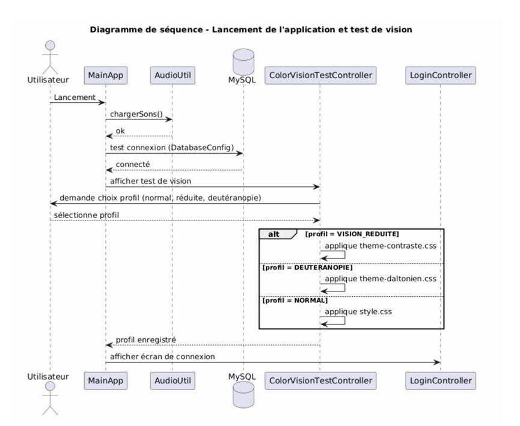
</a>
<sub><b>Accessibility Startup</b><br/>Color Vision Test</sub>
</td>
<td width="33%">
<a href="screenshots/06-sequence-request-submission.png">
  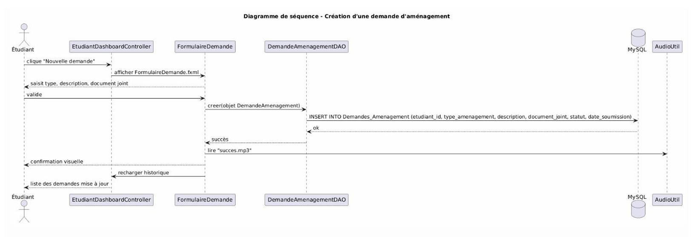
</a>
<sub><b>Request Submission</b><br/>Process Flow</sub>
</td>
</tr>
</table>
</div>

### 👨‍🎓 Student Workspace

<div align="center">
<table>
<tr>
<td width="50%">
<a href="screenshots/12-color-vision-test-red-green.png">
  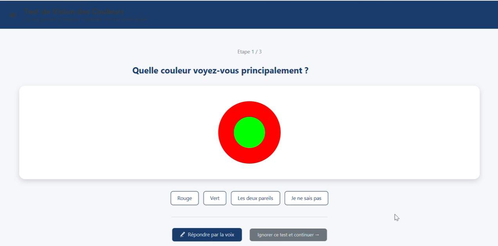
</a>
<sub><b>Color Vision Test</b><br/>Red/Green Blindness Detection</sub>
</td>
<td width="50%">
<a href="screenshots/13-color-vision-test-orange-green.png">
  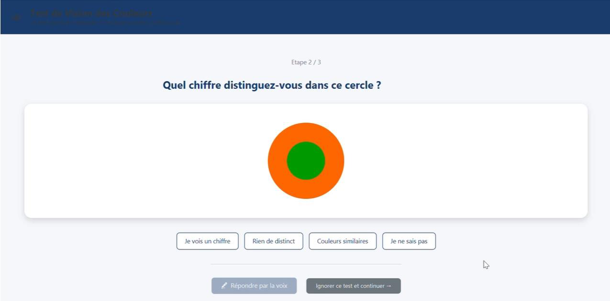
</a>
<sub><b>Color Vision Test</b><br/>Orange/Green Blindness Detection</sub>
</td>
</tr>
<tr>
<td width="50%">
<a href="screenshots/07-login-screen.png">
  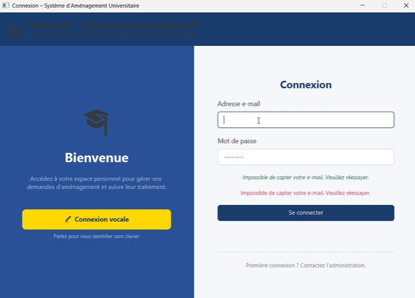
</a>
<sub><b>Login Screen</b><br/>Secure Authentication</sub>
</td>
<td width="50%">
<a href="screenshots/08-student-request-form.png">
  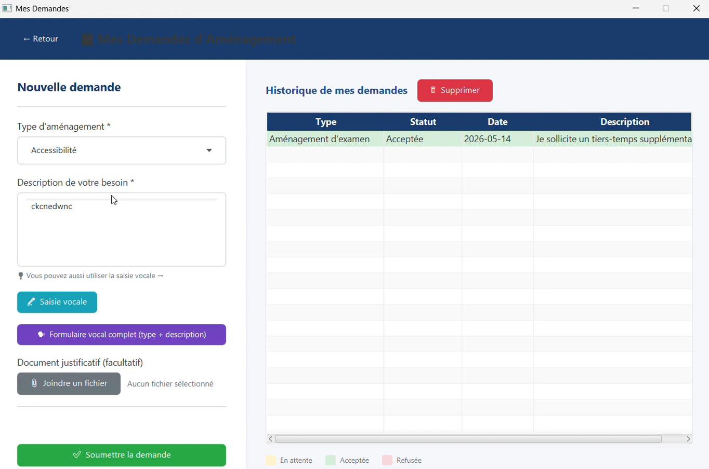
</a>
<sub><b>Accommodation Request</b><br/>Submit & Document</sub>
</td>
</tr>
<tr>
<td width="50%">
<a href="screenshots/09-student-request-history.png">
  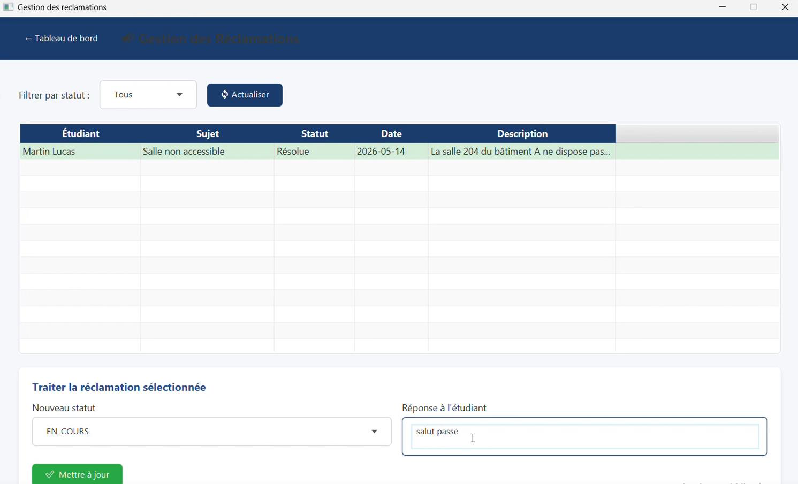
</a>
<sub><b>Request History</b><br/>Track Status</sub>
</td>
<td width="50%">
<a href="screenshots/16-student-dashboard-notifications.png">
  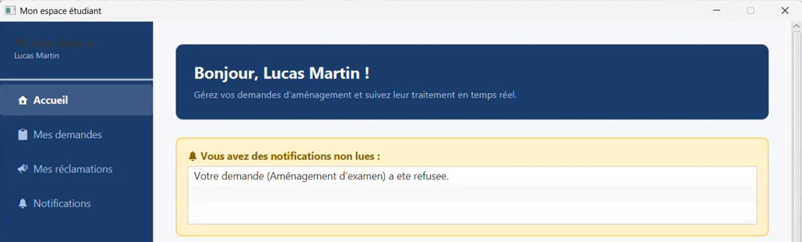
</a>
<sub><b>Notifications</b><br/>Audio & Visual Alerts</sub>
</td>
</tr>
</table>
</div>

### 🛠️ Administrator Workspace

<div align="center">
<table>
<tr>
<td width="50%">
<a href="screenshots/10-admin-dashboard-statistics.png">
  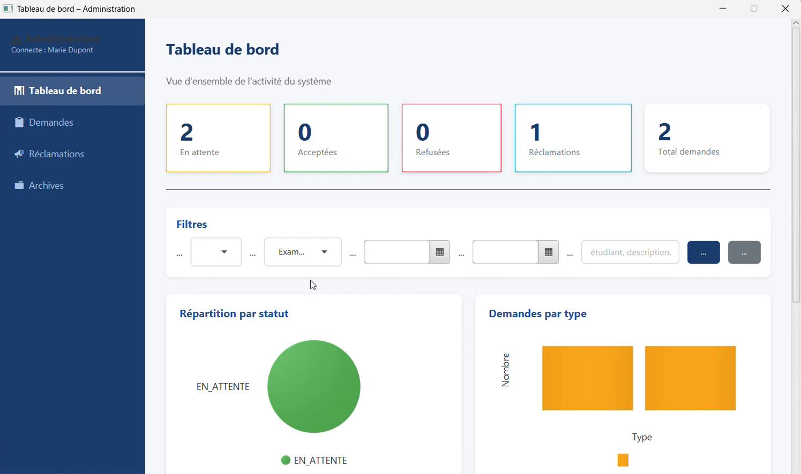
</a>
<sub><b>Admin Dashboard</b><br/>Statistics & Overview</sub>
</td>
<td width="50%">
<a href="screenshots/11-admin-archives-search.png">
  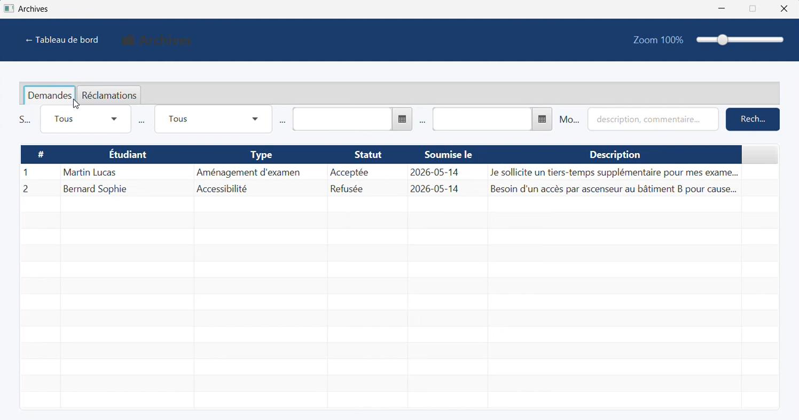
</a>
<sub><b>Archives & Search</b><br/>Filter Records</sub>
</td>
</tr>
</table>
</div>

### ♿ Accessibility & Export Features

<div align="center">
<table>
<tr>
<td width="50%">
<a href="screenshots/14-voice-command-button.png">
  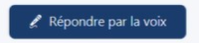
</a>
<sub><b>Voice Input</b><br/>Voice Commands</sub>
</td>
<td width="50%">
<a href="screenshots/15-pdf-export-button.png">
  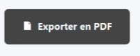
</a>
<sub><b>PDF Export</b><br/>Request Summaries</sub>
</td>
</tr>
</table>
</div>

---

## 🎬 Demo Videos

Watch the application in action! These videos demonstrate key features and workflows:

### 📹 Standard Workflow Demo

Experience the complete user journey through UniHandicap, from the color vision accessibility test to submitting accommodation requests.

<div align="center">

**[▶️ Watch Full Demo - TestNormal.mp4](videos/TestNormal.mp4)**

</div>

---

### 🎤 Voice Command Demo

See the voice-assisted accessibility feature in action. Control the application using natural voice commands for hands-free interaction.

<div align="center">

**[▶️ Watch Voice Demo - CommandeVocal.mp4](videos/CommandeVocal.mp4)**

</div>

---

## 📄 Documentation

Full project report:

[📘 Project Report](docs/Report.pdf)

Legacy project report (French):

[📘 Rapport Projet DisabiliteApp](docs/Rapport_Projet_DisabiliteApp.pdf)

Portfolio presentation file:

[💼 Portfolio Presentation](docs/PORTFOLIO_PRESENTATION.md)

---

## 🔐 Security Notes

- Database operations use `PreparedStatement` to reduce SQL injection risk.
- API keys, database passwords, `.env` files, generated files, and local speech models must not be committed.
- This repository is prepared for portfolio presentation and academic demonstration.

---

## 👥 Project Type

This is an academic team project. For portfolio use, clearly mention your exact contribution in interviews, your CV, and the GitHub repository description.

### Suggested "My Contribution" Section

Replace this with your real contribution before publishing:

```md
## 🙋 My Contribution

As part of the project team, I contributed to:

- JavaFX interface development
- MVC project structure
- Database integration with JDBC
- Student/admin workflow implementation
- Accessibility features and audio feedback
- Testing, debugging, and technical documentation
```

---

## 🧠 Skills Demonstrated

- Java desktop development
- JavaFX/FXML interface design
- MVC architecture
- JDBC and SQL database integration
- Role-based application workflows
- Accessibility-focused software design
- PDF generation
- GitHub project documentation
- Academic software engineering documentation

---

## 🗺️ Future Improvements

- Add email verification and password reset
- Improve role-based access control with stronger authorization rules
- Add automated unit tests
- Add CI build workflow with GitHub Actions
- Package the app as an executable installer
- Add a web version for remote access
- Improve UI responsiveness and dashboard analytics

---

## 📜 License

This project is licensed under the MIT License. See the [LICENSE](LICENSE) file for details.
